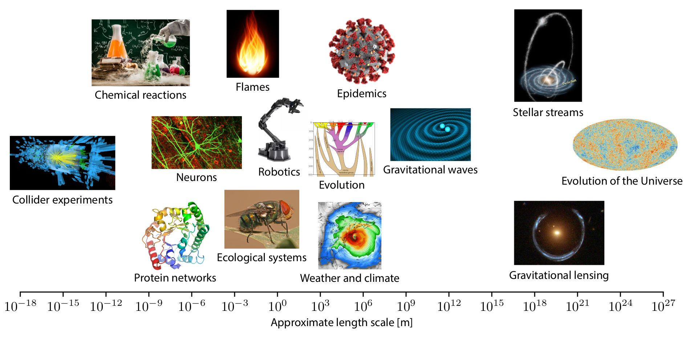
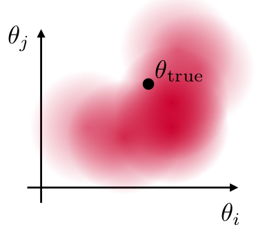
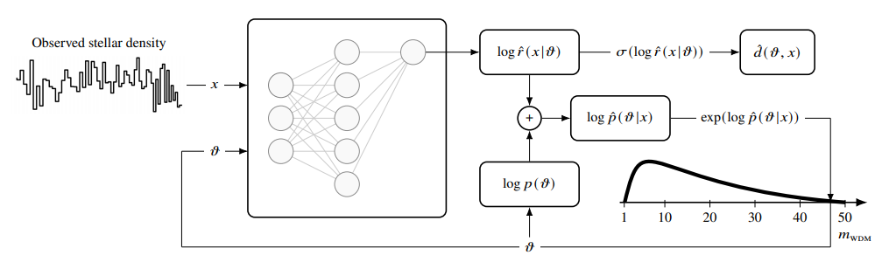
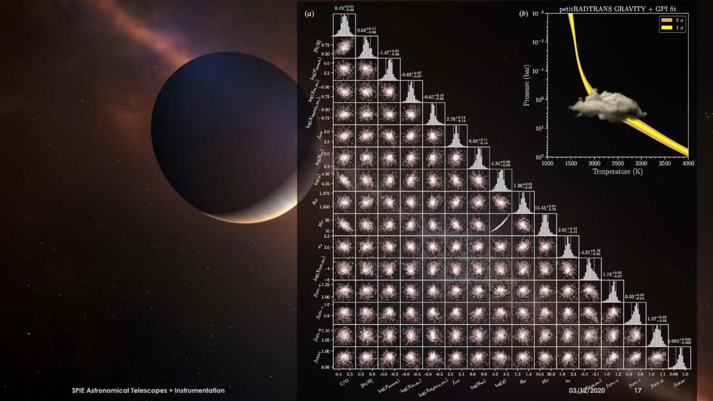
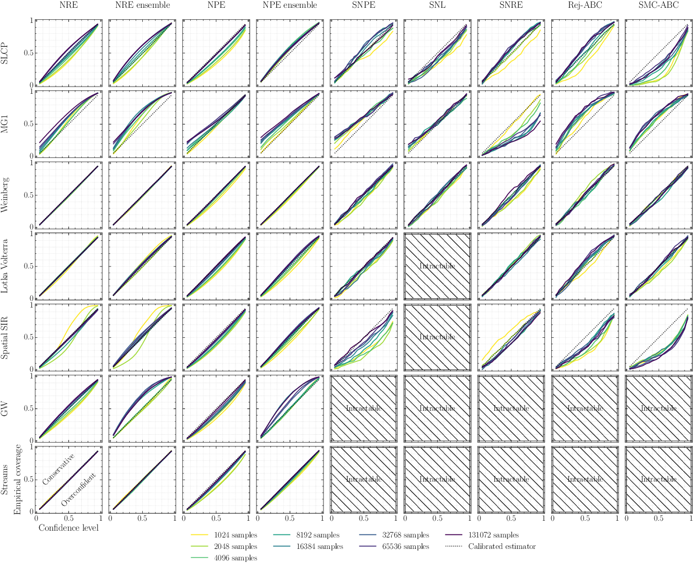

class: middle, center, title-slide
count: false

# An introduction to  simulation-based inference

March 21, 2022

 

Gilles Louppe 
[g.louppe@uliege.be](mailto:g.louppe@uliege.be)

---

class: smaller-x, middle, center

.grid[
.kol-1-5.center[.width-100[] Kyle Cranmer]
.kol-1-5.center[.width-100[] Juan Pavez]
.kol-1-5.center[.width-100[] Johann Brehmer]
.kol-1-5.center[.width-100[] Joeri Hermans]
.kol-1-5.center[.width-90[] Antoine Wehenkel]
]

.grid[
.kol-1-5.center[.width-100.circle[] Norman Marlier]
.kol-1-5.center[.width-100.circle[] Arnaud Delaunoy]
.kol-1-5.center[.width-100.circle[] Malavika Vasist]
.kol-1-5.center[.width-100.circle[] Francois Rozet]
.kol-1-5.center[.width-90.circle[] Omer Rochman]
]

.grid[
.kol-1-5.center[.width-100[] Siddarth Mishra-Sharma]
.kol-1-5.center[.width-100[] Lukas Heinrich]
.kol-1-5.center[.width-100.circle[] Christophe Weniger]
.kol-1-5.center[.width-100.circle[] Gianfranco Bertone]
.kol-1-5.center[.width-90.circle[] Nil Banik]
]

---

# Scientific simulators

 

.center.width-100[]

---

class: middle

.center.width-80[]

.center.width-70[]

.center[$$\theta, z, x \sim p(\theta, z, x)$$]

---

class: middle, center

.center.width-80[]

.center.width-70[]

This results in the likelihood
$p(x | \theta) = \int p(x, z| \theta) dz$
to be intractable.

---

class: middle
count: false

# Simulation-based inference 

---

class: middle

Start with
- a simulator that lets you generate $N$ samples $x\_i \sim p(x\_i|\theta\_i)$,
- observed data $x\_\text{obs} \sim p(x\_\text{obs} | \theta\_\text{true})$,
- a prior $p(\theta)$.

Then, estimate the posterior $$p(\theta|x\_\text{obs}) = \frac{p(x\_\text{obs} | \theta)p(\theta)}{p(x\_\text{obs})}$$

<!-- .grid[
.kol-1-3.center[a) estimate $\theta\\\_\text{true}$  (e.g., MLE)]
.kol-1-3.center[b) construct  confidence sets]
.kol-1-3.center[c)$]
] -->

.center.width-40[]

---

class: middle

.center.width-100[]

---

class: middle
count: false

.center.width-100[]

---

class: middle
count: false

.center.width-100[]

---

class: middle

.width-100[]

.footnote[[Cranmer, Brehmer and Louppe](https://doi.org/10.1073/pnas.1912789117), 2020.]

---

# Neural Ratio Estimation (NRE)

 

.pull-right[]
The Bayes rule can be rewritten as
$$
\begin{aligned}
p(\theta|x) &= \frac{p(x|\theta) p(\theta)}{p(x)} \\\\
&= r(x|\theta) p(\theta) \\\\
&\approx \hat{r}(x|\theta)p(\theta)
\end{aligned}
$$
where $r(x|\theta) = \frac{p(x|\theta)}{p(x)}$ is the likelihood-to-evidence ratio.

.footnote[[Cranmer, Pavez and Louppe](https://arxiv.org/abs/1506.02169), 2015; [Hermans and Louppe](http://proceedings.mlr.press/v119/hermans20a/hermans20a.pdf), 2020.]

???

Do the full derivation on the blackboard, including the proof.

---

class: middle

## The likelihood ratio trick

The ratio can be learned with machine learning, even if neither the likelihood nor the evidence can be evaluated!

.grid[
.kol-1-3.center[

 

$x,\theta \sim p(x,\theta)$

     

$x,\theta \sim p(x)p(\theta)$

]
.kol-2-3[.center.width-80[]]
]

---

class: middle

The solution $d$ found after training  approximates the optimal classifier
$$d(x, \theta) \approx d^\*(x, \theta) = \frac{p(x, \theta)}{p(x, \theta)+p(x)p(\theta)}.$$
Therefore, $$r(x|\theta) = \frac{p(x|\theta)}{p(x)} = \frac{p(x, \theta)}{p(x)p(\theta)} \approx \frac{d(x, \theta)}{1-d(x, \theta)} = \hat{r}(x|\theta).$$

---

class: middle

## Inference

.center.width-100[]

---

# Neural Posterior Estimation (NPE)

 

.pull-right[]
Use variational inference to directly estimate the posterior:
$$\min\_{q\_\phi} \mathbb{E}\_{p(x)}\left[ \text{KL}( p(\theta|x) || q\_\phi(\theta|x) ) \right]$$
where $q\_\phi$ is a neural density estimator, such as a normalizing flow.

???

After that, mention amortization vs. sequential estimation. Go back to the main figure.

---

# Sequential estimation

When the posterior concentrates significantly compared to the prior, then we do not need to estimate the likelihood or posterior accurately everywhere:
- Instead, we can approximate the likelihood or posterior only in relevant regions of the parameter or data space.
- Active learning: iteratively estimate the likelihood or the posterior $p\_t(\theta|x)$, sample $\theta \sim p\_t(\theta|x)$, $x \sim p(x | \theta)$ and then refine.

.center.width-100[]

---

class: middle
count: false

# Showtime!

---

background-image: url(./figures/stellar.jpeg)
background-position: left
class: black-slide

.smaller-x[ ]
## Constraining dark matter with stellar streams

      
.pull-right[
  
<iframe width="360" height="270" src="https://www.youtube.com/embed/uQVv_Sfxx5E?&loop=1&start=0" frameborder="0" volume="0" allowfullscreen></iframe>

]

.footnote[Image credits: C. Bickel/Science; [D. Erkal](https://t.co/U6KPgLBdpz?amp=1).].]

---

class: middle

.center.width-100[]

.center[
.width-35[]
.width-35[]

Preliminary results for GD-1 suggest a **preference for CDM over WDM**.
]

.footnote[[Hermans et al](https://arxiv.org/pdf/2011.14923), 2021.]

---

class: middle, black-slide

## Atmospheric characterization of exoplanets

.width-100[]

.footnote[Image credits: [Lacour et al](https://doi.org/10.1117/12.2561667), 2020.]

---

class: middle

## Robotic multi-fingered grasping 

.center[

.width-65[]
<video controls preload="auto" height="225" width="500" autoplay loop>
  <source src="https://video.twimg.com/ext_tw_video/1445251463261872128/pu/vid/478x270/pVbx4507NgMLv3tn.mp4" type="video/mp4">
</video>
]

.footnote[[Marlier, Bruls and Louppe](https://arxiv.org/pdf/2109.14275.pdf), 2021.]

---

class: middle

## Is this reliable?

Coverage diagnostic:
- For every $x,\theta \sim p(x,\theta)$ in a validation set, compute the $1-\alpha$ credible interval based on $\hat{p}(\theta|x)$.
- The fraction of samples for which $\theta$ is contained within the interval corresponds to the empirical coverage probability.

.grid[
.kol-1-2[If the empirical coverage is larger that the nominal coverage probability $1-\alpha$, then the approximate posterior $\hat{p}(\theta|x)$ has coverage.]
.kol-1-2[.center.width-80[]]
]

.footnote[Image credits: [Siddharth Mishra-Sharma, 2021](https://arxiv.org/abs/2110.01620).]

---

class: middle

.center.width-100[]

.footnote[[Hermans et al, 2021](https://arxiv.org/abs/2110.06581).]

---

class: middle

## What if the simulation model is not accurate or incomplete?

.center.width-100[]

.footnote[Image credits: [Gert-Jan Both](https://gjboth.github.io/thesis/deepmod.html), 2021.]

---

class: middle

## `lampe`: amortized simulation-based inference

.center.width-70[]

.footnote[[Rozet](https://github.com/francois-rozet/lampe), 2022.]

---

# Summary

  

.question[Simulation-based inference is a major evolution in the statistical capabilities for science, enabled by advances in machine learning.]

.alert[Need to reliably assess the quality of the posterior approximations.]

.alert[Need to efficiently generate simulated data and use it to train ML components.]
  
---

class: end-slide, center
count: false

The end.
